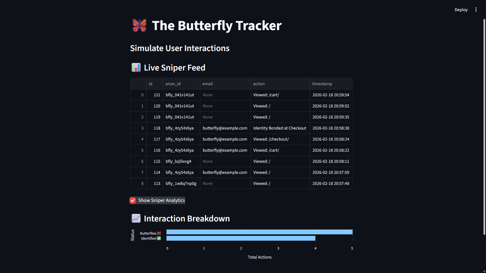

# 🦋 Butterfly Engine: Real-Time Identity Resolution

The **Bond Engine** is a data pipeline built to bridge the gap between anonymous web visitors and identified user profiles. This project features a **Retroactive Identity Stitching** system that connects a user's past browsing history to their identity the moment they sign up or check out.

### 🚀 The Main Feature: "Retroactive Stitching"
Most tracking tools only start recording data after a user logs in. The **Bond Engine** starts tracking anonymously from the very first click. Once a user identifies themselves (like entering an email at checkout), the system goes back in time and "stitches" their entire anonymous history to their new profile, so no data is lost.

---

### 🛠️ How it's Built
The project is split into three separate parts that work together:

1. **The Storefront (Django):** - A full e-commerce website where users browse products.
   - *Attribution:* The base store template and logic were provided by [Dennis Ivy](https://github.com/divanov11/django-ecommerce-website).
   - *My Addition:* Custom JavaScript "listeners" that watch for user behavior and handle the identity bonding.

2. **The Processing Brain (FastAPI):**
   - A standalone server that handles incoming data.
   - It manages the database and runs the logic that connects anonymous IDs to real emails.

3. **The Live Dashboard (Streamlit):**
   - A monitoring tool that shows the database in real-time.
   - It triggers **Discord** alerts to notify sales teams when a high-value user is identified.

---

### 🧠 How the Logic Evolved

* **Phase 1: A "Brain-First" Approach:** I started by building the logic in FastAPI first. I wanted to create a central hub that could process tracking data independently. Instead of building a whole website from scratch, I found a solid e-commerce "Body" in Django and connected the two. This shows the system is flexible—the Brain could technically work with any frontend.
* **Phase 2: Finding the Data Gap:** I realized that if someone browses 10 products and then enters their email, those 10 views would stay "anonymous" and be wasted.
* **Phase 3: The "Stitch" Solution:** I used `localStorage` to give every browser a unique "Butterfly ID." When an email is captured, the system runs a search through the database and updates all old records that have that ID with the new email.
* **Phase 4: Real-Time Notifications:** I added Discord alerts to act like a "Sales Sniper" tool, so a team knows exactly when a specific person returns to the site.

---

### 📊 Tech Stack
* **Languages:** Python, JavaScript, SQL
* **Frameworks:** Django, FastAPI, Streamlit
* **Database:** SQLite3
* **Integrations:** Discord Webhooks

---

### ⚙️ Setup and Usage

To run this project locally, you will need to open three separate terminals and run these commands:

1. **Start the FastAPI Brain:**
   ```bash
   uvicorn server:app --port 8001 --reload
   ```

2. **Start the Django Store:**
   ```bash
   cd django_ecommerce_mod5
   python manage.py runserver
   ```
3. Start the Streamlit Dashboard:
   ```bash
   streamlit run app.py
   ```

### 💡 The Big Picture (Future Scaling)

If this were expanded for a massive company, the tools would grow into:
* **Kafka:** To handle millions of clicks at once without crashing.
* **Redis:** For instant, split-second user recognition.
* **Snowflake:**: For storing years of historical data for deep analysis.

### 📊 The Intelligence (Dashboard)


   
